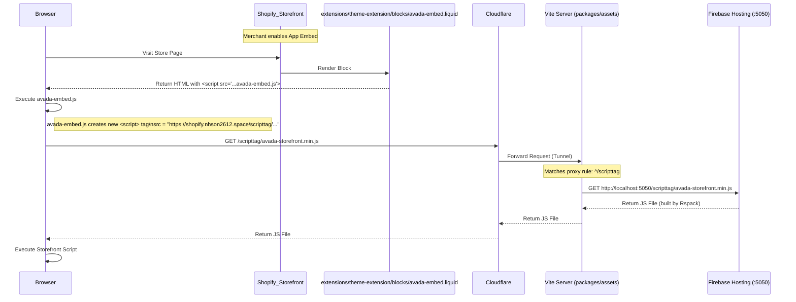
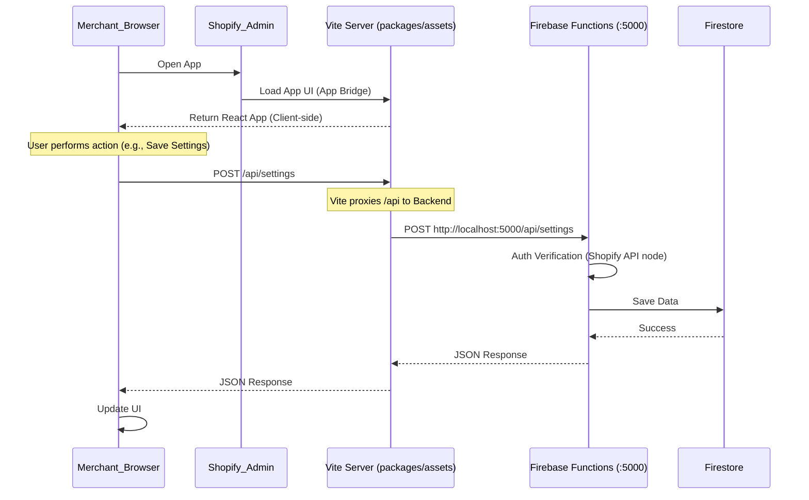
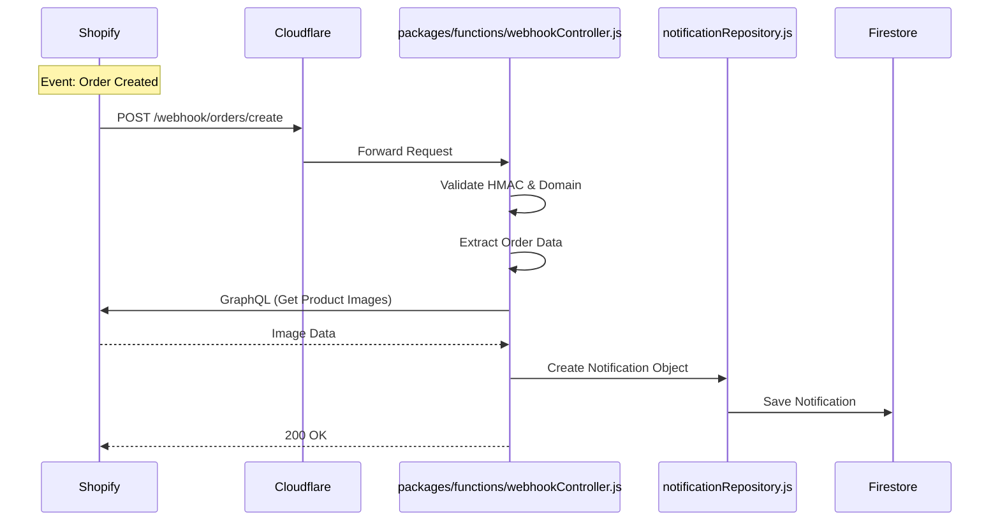

# Project Workflow Documentation

This document outlines the end-to-end workflow of the project, covering development setup, codebase structure, and the request flows for both the Storefront and the Admin interface.

## 1. High-Level Architecture

The project is a Shopify App built with a Microservices-like architecture using Firebase.

```mermaid
graph TD
    User((User/Browser))
    Shopify((Shopify Platform))
    Cloudflare((Cloudflare Proxy))
    
    subgraph Local_Dev_Environment [Local Development Environment]
        Vite[Vite Dev Server\n(packages/assets)]
        Rspack[Rspack Watcher\n(packages/scripttag)]
        Firebase_Hosting[Firebase Hosting Emulator\n(Port 5050)]
        Firebase_Functions[Firebase Functions Emulator\n(Port 5000)]
        Firestore[(Firestore Emulator\n(Port 8080))]
    end

    User -->|Storefront Visit| Shopify
    User -->|Admin Visit| Shopify
    
    Shopify -->|App Embed Script| Cloudflare
    Shopify -->|App Bridge UI| Cloudflare
    
    Cloudflare -->|Tunnel| Vite
    
    Vite -->|/scripttag| Firebase_Hosting
    Vite -->|/api, /webhook| Firebase_Functions
    
    Firebase_Functions --> Firestore
    Rspack -->|Builds to static/scripttag| Firebase_Hosting
```

## 2. Codebase Structure & Responsibilities

| Package | Path | Tech Stack | Purpose |
| :--- | :--- | :--- | :--- |
| **Assets** | `packages/assets` | React, Vite | Main Admin UI (App Bridge), Standalone App. |
| **Functions** | `packages/functions` | Node.js, Firebase | Backend logic, API endpoints, Webhook handlers. |
| **Scripttag** | `packages/scripttag` | Preact, Rspack | Lightweight script for the Storefront. |
| **Extensions** | `extensions/theme-extension` | Liquid, JS | Shopify Theme App Extension (App Embed). |

## 3. Storefront Script Injection & Loading Flow

This workflow illustrates how the script appears on the merchant's store.



## 4. Admin UI & Backend API Flow

This workflow shows how the Merchant interacts with the app inside the Shopify Admin.



## 5. Webhook Processing Flow

How Shopify notifies the app about events (e.g., Order Created).


